# Backend_RecomendAI
Backend del proyecto I de Inteligencia Artificial (UCAB)

Está realizado con una arquitectura hexagonal, siguiendo los principios de Domain Driven Design.

# Herramientas a Descargar

1- Descargar Visual Studio Code.

2- Descargar el repositorio del backend de recomendAI.

3- Descargar SQL Server y realizar las siguientes configuraciones:

Se selecciona la opción de “SQL Server en el entorno local”.

Ver el siguiente video para crear un usuario y poder ingresar utilizando *Sql Server Authentication*: <https://youtu.be/MpCv2oTPde4?si=UwqymWY1cy_qnTEj>

# Configuración del Visual Studio

1. Primero crear una Clase con el nombre de **appsettings.json** dentro de la carpeta** *Backend\_RecomendAI,* para posteriormente pegar este código:

Nota: En ***Secreta*** debe colocar una clave larga (justo 30 caracteres, recuerda usar algún caracter especial si es posible).

Recuerdes colocar sus credenciales de la BD, eso es lo que va en ***ConexionSql***

{
  "ApiSettings": {
 "Secreta": "-------“
},
 "ConnectionStrings": {
  "ConexionSql": "Server=nombre\_de\_tu\_servidor;Database=RecomendApi;User ID=tu\_usuario;Password=tu\_contraseña;Trusted\_Connection=true;TrustServerCertificate=true;MultipleActiveResultSets=true"
},
"Logging": {
"LogLevel": {
      "Default": "Information",
      "Microsoft.AspNetCore": "Warning"
    }
  },
"AllowedHosts": "\*"
}

2. Posterior a la creación del archivo, y la configuración del código para la conexión y creación de la BD, se debe pasar a correr cada una de las Migraciones.

   Esto se hace con el objetivo de que desde .NET7 se cree cada una de las tablas.

Nota: ER de la nuestra base de datos relacional

3. Por cada migración se hará lo siguiente en la consola de Administrador de paquetes 

   **Add-migration NombreMigracion** 

   Ejemplo: Add-migration 20240428034447\_NuevaModificacionCuatroDeTablaLike

   Seguidamente de ello 

   **Update-database**

Esto hará que se cree la base de datos en nuestro SQL server con el nombre que se allá puesto en     "ConexionSql": Database…

4. Al culminar con la ejecución de todas las migraciones en nuestra consola de paquetes Nuget, se puede proceder a subir la data a la base de datos.

# Configuración para importar la data a la Base de datos

1. Se descargará el siguiente repositorio completo y de ello usaremos el **CSV Data\_pelicula** para insertar esa data en nuestra base de datos.

<https://github.com/andreselc/IARecommendModel>

**NOTA: Configuración para el Modelo IA**

Está asociado al **endpoint Recomiendame** en el RecomendController.

1. Descargar los archivos del repositorio que está en el inciso superior (1)
2. Para poder ejecutar correctamente la api, recuerden **instalar** los módulos de Python que estén en los código para evitar errores:

   Pip install flask

   Pip install matplotlib

   Pip install sklearn

   .

   .

   .

   **Nota:** Para instalar Pandas debe seguir los pasos explicados en el siguiente video (así evitará cualquier error)

   <https://www.youtube.com/watch?v=D_FrHmKYNLw>

3. Al completar la instalación de cada módulo, podrá ejecutar la api (RecommendApi) y el modelo (tf\_idf.py) sin ningún problema

**Recomendación:** al usar el backend en .NET7 (api principal) deberá correr primero la api del modelo y mantenerla activa para que el endpoint de recomendación funcione correctamente.

2. Al culminar con la migración como se comentaba en el inciso anterior del apartado de **Configuración del Visual Studio Code**, se deberá ir a SQL Server y buscar la base de datos que se creó, en nuestro caso en los datos de ConexionSql colocamos el nombre RecomendApi, es por ello que esa en la base de datos que se ve en la imagen y es esa donde insertaremos la data.
2.1. Primero, inicia sesión, se van a su base de datos y siguen estos pasos, al seleccionar el apartado Import Data 

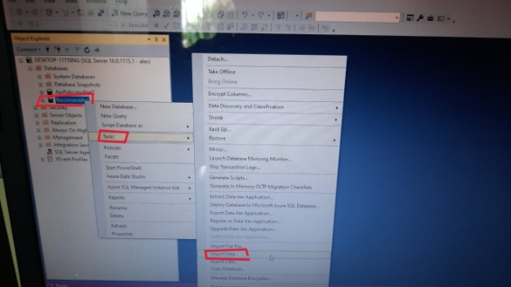

2.2. Después de darle a Import Data:

Seleccione el browser para buscar el archivo csv y subirlo.

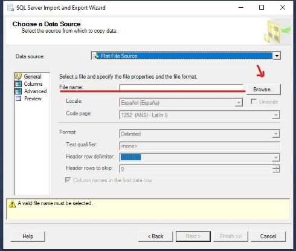

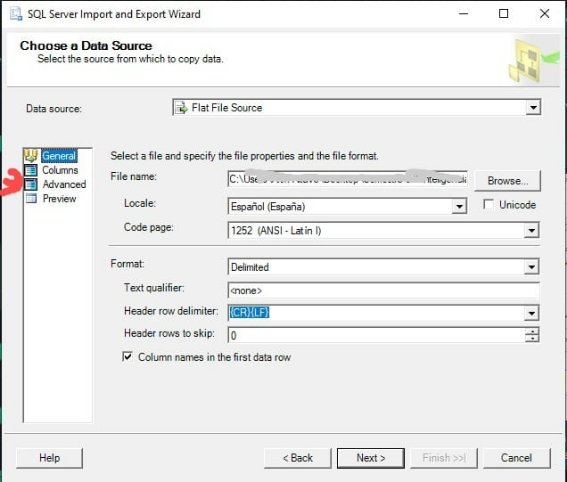

2.3. Se irá al apartado Advanced para indicar el tipo de dato de cada columna, deben modificar el tipo de dato de cada uno (guiarse con cada una de las fotos a continuación).

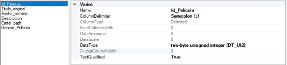

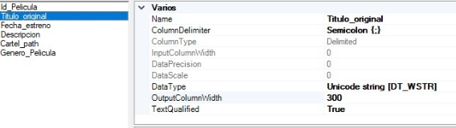

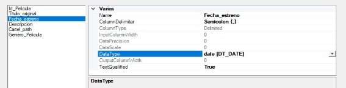

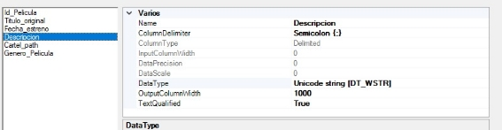

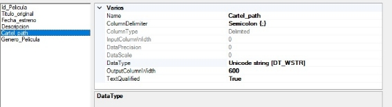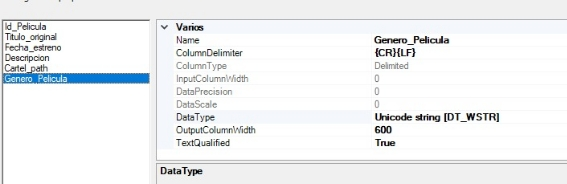

2.4. Después de completar la configuración anterior y darle a next, en la siguiente ventana seleccionaran **Microsoft OLE BD Driver For SQL Server**

   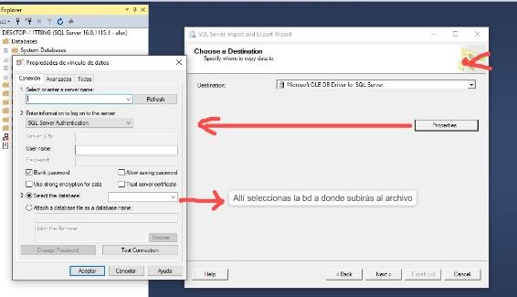

Aquí colocan sus datos de conexión, el nombre de su servidor, su usuario, contraseña y por último seleccione la base de datos, en nuestro caso sería “RecomendApi” 

Ejemplo:

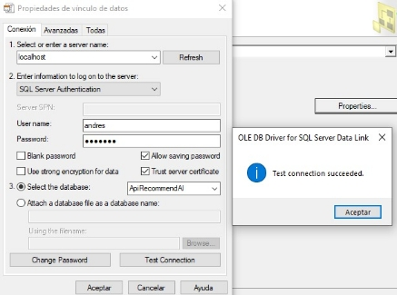

2.5. Después del paso anterior, se continuará con esta ventana 

   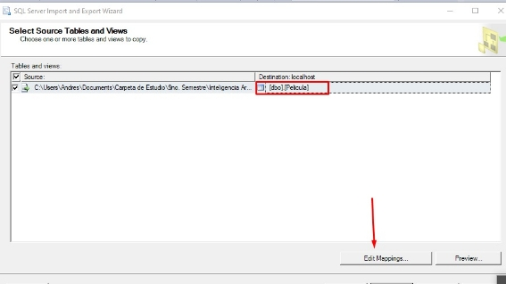

El recuadro en rojo representa la tabla en la cual insertaremos la data del csv Data\_pelicula, recuerden seleccionar la **tabla Pelicula** de su base de datos que se creó al momento de correr todas las migraciones.

2.6. Posterior a ello, se selecciona Edit Mappings… allí se realiza esta configuración 

   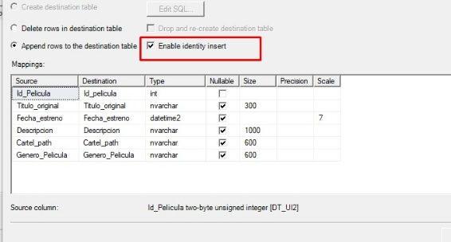

Seleccionará la opción que se muestra dentro del recuadro rojo.

2.7. Después de completar la configuración pasamos a la última ventana 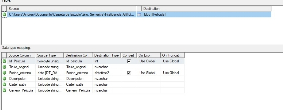

Al encontrarnos en esta ventana se deberá dar **next** y en la última parte seleccione la opción **Run Inmediately** y finaliza el proceso.

Si no hay ningún error en alguna de las configuraciones previas deberá mostrar checks verdes. 

**Recomendación: Realizar un Select \* from dbo.Pelicula** 

Con eso saben cuántas se insertaron, deben tener un total de 6616 películas insertadas.

3. Al finalizar podrán usar con normalidad nuestro backend.

## Liberías y dependencias externas utilizadas:

## Authors

- ### [@Andrés López](https://github.com/andreselc) 
- ### [@Alex Altuve](https://github.com/Alex-Altuve)  
